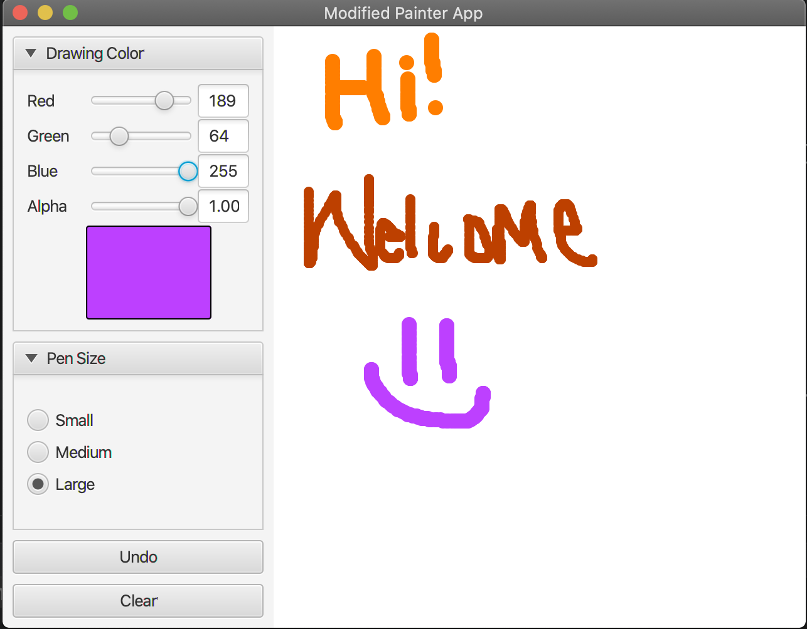

# Painter App
Painter Application written in Java.

This Painter GUI allows the user to: 

1) Select brush size (Small, Medium, or Large).
2) Select the color (RGB and Transparency).
3) Undo a drawing.
4) Clear drawing pane.

. 
